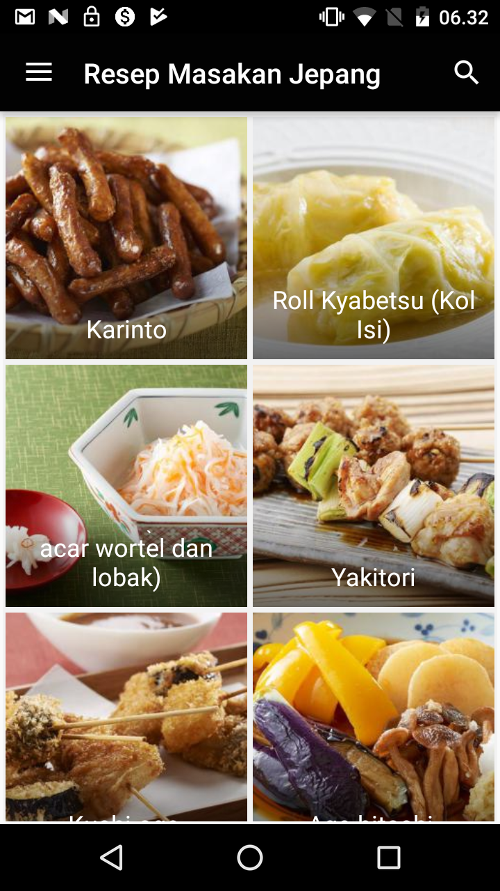
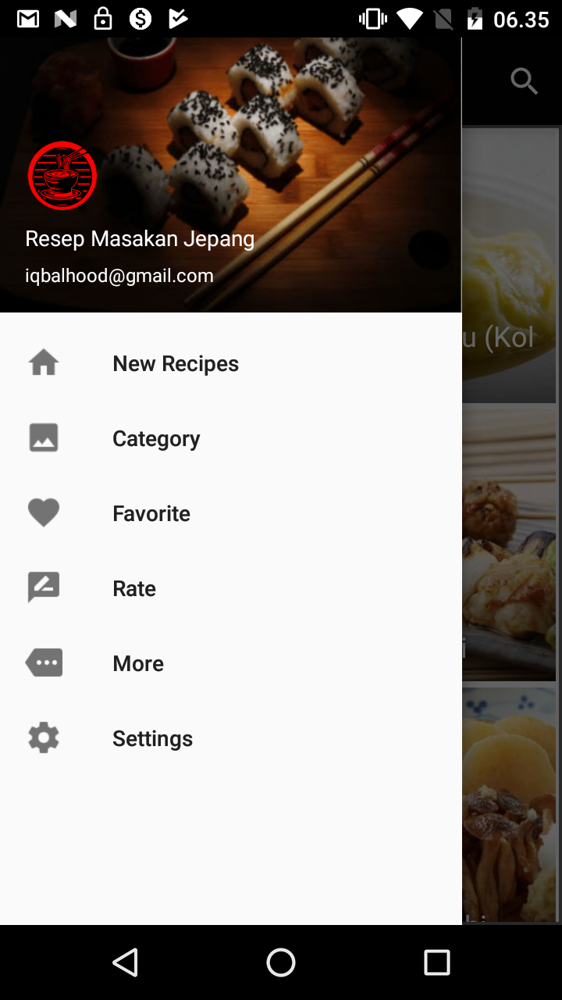
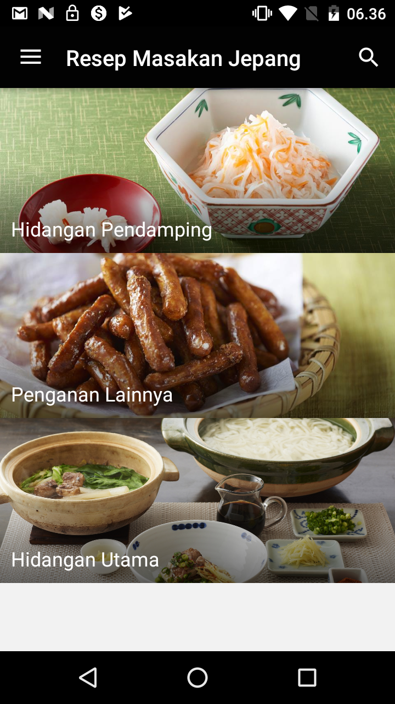
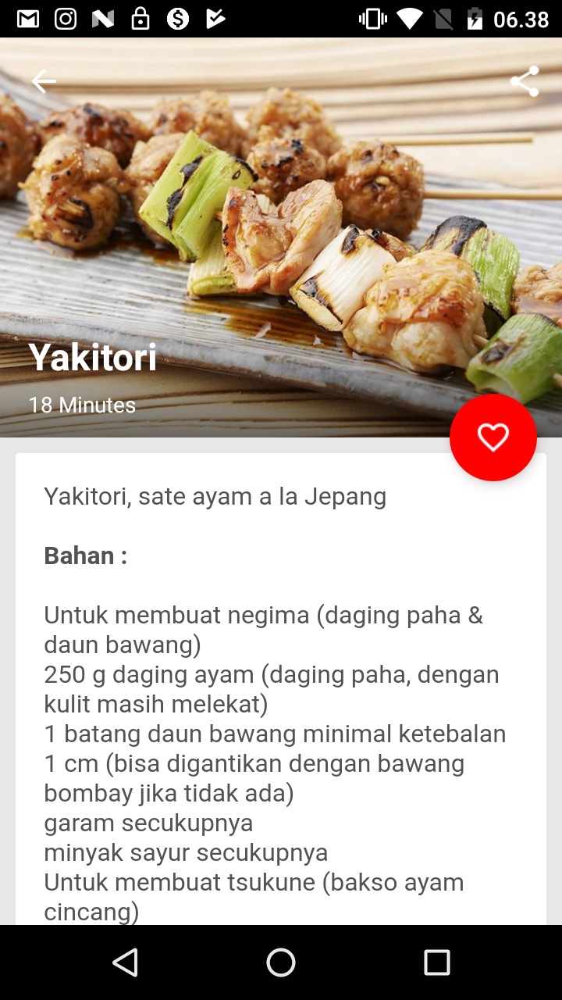

# JapanFoodRecipe

Culinary Japan is never bored to try, in addition to processing that is still thick with several food traditions have a unique way when eating it. This app is made for those who want to make their own japanese cuisine. This app include a simple guide to the famous Japanese cuisine menu in Indonesia.

## Demo

  
  
  

  
  
  
  

### Download It

#### Made with &#9829;
Follow me on instagram :)
- [@iqbalhood](https://instagram.com/iqbalhood)

### Contribution Process

1. Submit an issue describing your proposed change to the repo in question.
1. The repo owner will respond to your issue promptly.
1. Fork the desired repo, develop and test your code changes.
1. Ensure that your code adheres to the existing style of the library to which
   you are contributing.
1. Ensure that your code has an appropriate set of unit tests which all pass.
1. Submit a pull request and cc @iqbal09
